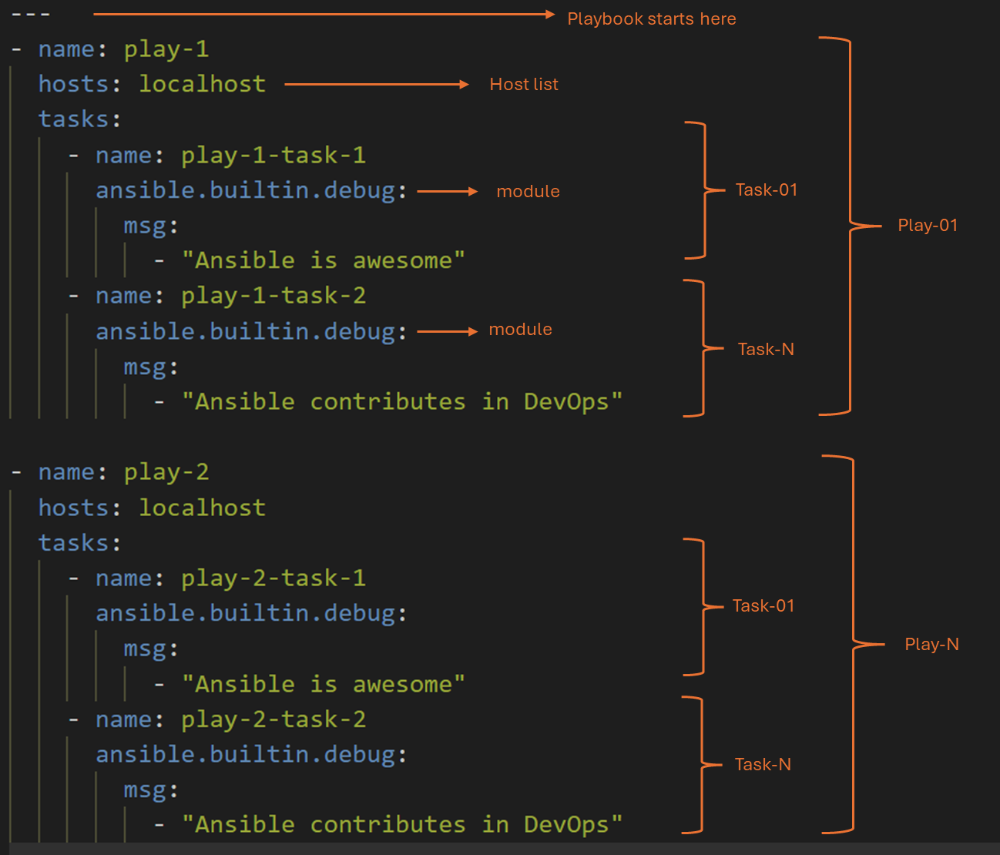

# Ansible Playbooks

## 01. Playbook Syntax

- Ansible playbooks are YAML files.
- In order to write an ansible playbook, you must be familiar with YAML.
- A **playbook** is composed of one or more **plays** in an ordered list.
- The terms _playbook_ and _play_ are sports analogies.
- Each play executes part of the overall goal of the playbook, running one or more tasks.
- Each task calls an Ansible module.

## 02. Playbook Execution

## 03. Ansible-Pull

## 04. Verifying playbooks
